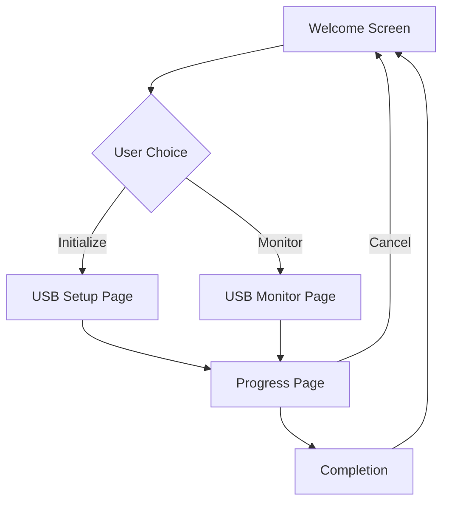
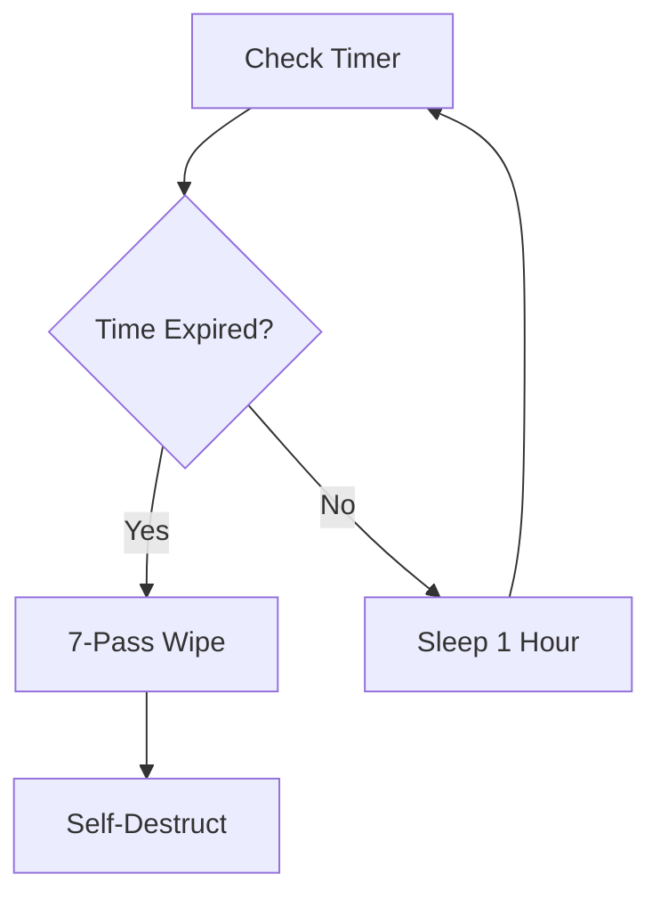

# secure-auto-wipe-tool 🔒⏳⚡


GUI:


**Military-Grade Automated Data Destruction Solution**  
*"Your data vanishes like it never existed - precisely when you need it to"*

 


    
## 📖 Overview
Secure Auto-Wipe Tool is an NSA-grade automated data destruction system that combines military-grade cryptography with physical media sanitization. Designed for sensitive operations, this tool automatically and irreversibly destroys all data on USB drives after a preset time interval (6/12/24 hours) using a dual-layer security approach:

1. **AES-256-GCM Encryption** - All files are encrypted at rest
2. **DoD 5220.22-M Compliant Wiping** - 7-pass secure deletion protocol
3. **Tamper-Proof Countdown Timer** - HMAC-protected destruction schedule

## 🛠 Installation

### Requirements
- Python 3.8+
- Linux/macOS/Windows (Tested on Ubuntu 22.04/Win11/macOS Ventura)

```bash
# 1. Clone repository
git clone https://github.com/coddard/Secure-Auto-Wipe-Tool.git
cd Secure-Auto-Wipe-Tool

# 2. Install dependencies
pip install pycryptodomex

# 3. Verify installation
python Secure-Auto-Wipe-Tool.py --help


```markdown
# Secure-Auto-Wipe-Tool 🔒⏳⚡

**Military-Grade Automated Data Destruction Solution**  
*"Your data vanishes like it never existed - precisely when you need it to"*

 


## 📖 Overview
Secure-Auto-Wipe-Tool is an NSA-grade automated data destruction system that combines military-grade cryptography with physical media sanitization. Designed for sensitive operations, this tool automatically and irreversibly destroys all data on USB drives after a preset time interval (6/12/24 hours) using a dual-layer security approach:

1. **AES-256-GCM Encryption** - All files are encrypted at rest
2. **DoD 5220.22-M Compliant Wiping** - 7-pass secure deletion protocol
3. **Tamper-Proof Countdown Timer** - HMAC-protected destruction schedule

## 🛠 Installation

### Requirements
- Python 3.8+
- Linux/macOS/Windows (Tested on Ubuntu 22.04/Win11/macOS Ventura)

```bash
# 1. Clone repository
git clone https://github.com/coddard/Secure-Auto-Wipe-Tool.git
cd Secure-Auto-Wipe-Tool

# 2. Install dependencies
pip install pycryptodomex

# 3. Verify installation
python Secure-Auto-Wipe-Tool.py --help
```

## 🚀 Usage

### Initialization (First Run)
```bash
# Initialize with 24-hour destruction timer
python Secure-Auto-Wipe-Tool.py.py /path/to/usb -t 24 --init
```
- You'll be prompted for a secure passphrase
- All files will be encrypted in-place
- Destruction timer starts immediately

### Normal Operation
```bash
# Background execution (Linux/macOS)
nohup python Secure-Auto-Wipe-Tool.py /path/to/usb &

# Windows (Run in separate cmd window)
start /B python Secure-Auto-Wipe-Tool.py D:\USB
```
# Secure Auto-Wipe Tool - GUI Features

## Overview
The Secure Auto-Wipe Tool GUI provides a user-friendly interface for the military-grade secure USB data destruction system. This implementation maintains all the security features of the original command-line tool while adding an intuitive graphical interface.

## Key Features

### 🖥️ User Interface
- **Professional Dark Theme**: Modern security-focused interface with dark colors
- **Multi-Page Layout**: Organized workflow with dedicated pages for each function
- **Responsive Design**: Adapts to different screen sizes
- **System Tray Integration**: Runs in background with tray icon for monitoring

### 🔐 Security Features
- **Military-Grade Encryption**: AES-256 encryption for sensitive data
- **7-Pass Secure Deletion**: NSA-approved file wiping algorithm
- **Password Protection**: Strong passphrase requirement for initialization
- **Automatic Destruction**: Data wiped after specified time period
- **Emergency Wipe**: Immediate data destruction option

### ⚙️ Core Functionality
- **USB Initialization**: 
  - Set wipe timer (6/12/24 hours)
  - Password-protected setup
  - Drive selection with browse dialog
  
- **USB Monitoring**:
  - Real-time status display
  - Countdown timer showing time until wipe
  - Background monitoring capability
  
- **Progress Tracking**:
  - Real-time progress bars
  - Status messages for all operations
  - Time remaining display

### ⚠️ Safety Features
- **Multiple Confirmations**: Warning dialogs for destructive operations
- **Password Validation**: Minimum 8-character requirement
- **Password Confirmation**: Must enter passphrase twice
- **Operation Cancellation**: Ability to stop ongoing processes
- **Error Handling**: Clear error messages for all failure scenarios

### 🔄 Workflow


### 📊 System Integration
- **Logging**: Detailed operation logging to file
- **Platform Support**: Works on Windows, macOS, and Linux
- **Taskbar Integration**: Proper application identification in taskbar
- **Background Operation**: Continues monitoring when minimized

### 🛠️ Technical Features
- **Threaded Operations**: Background processing keeps UI responsive
- **Fallback Crypto**: Pure Python crypto implementation if libraries missing
- **Automatic Updates**: Time calculation and display
- **Command Line Support**: Original CLI functionality preserved

## System Requirements
- Python 3.6+
- PyQt5 (`pip install pyqt5`)
- Recommended: pycryptodome (`pip install pycryptodome`) for enhanced security

## Visual Design

*Clean, professional interface with security-focused color scheme*

## Security Notes
- Passwords are never stored or logged
- All sensitive operations require confirmation
- Actual crypto implementation depends on installed libraries
- Fallback crypto should not be used in production environments

This GUI implementation provides a comprehensive, user-friendly interface for the secure auto-wipe functionality while maintaining all the security features of the original command-line tool.

## 🔍 How It Works

### Phase 1: Initialization
1. **Key Derivation**  
   `PBKDF2-HMAC-SHA512` (210,000 iterations) creates encryption key
2. **File Encryption**  
   All files encrypted with AES-256-GCM (16-byte nonce, 16-byte tag)
3. **Timer Setup**  
   HMAC-Secured timestamp stored in hidden sector

### Phase 2: Background Process


### Phase 3: Secure Deletion
1. **Crypto-Shredding** - Overwrite encrypted files 7x with random data
2. **Metadata Purge** - Wipe directory entries and FAT tables
3. **Self-Destruction** - Remove all tool traces from USB

## 🛡 Security Features

| Feature                      | Specification                          |
|------------------------------|----------------------------------------|
| Encryption Standard          | AES-256-GCM (NIST FIPS 197)            |
| Key Derivation               | PBKDF2-HMAC-SHA512 (210k iterations)   |
| Wiping Standard              | DoD 5220.22-M (7 passes)               |
| Tamper Protection            | BLAKE2b HMAC with Time-Key Binding     |
| Memory Security              | Zeroization of sensitive buffers      |
| Anti-Forensic                | Journaling FS protection               |

## ❓ FAQ

**Q: Does this work on SSDs?**  
A: While effective, physical media characteristics may affect completeness. Use with hardware-encrypted drives for maximum security.

**Q: Can I change the timer?**  
A: Timer is immutable after initialization to prevent tampering.

**Q: What if I lose the passphrase?**  
A: Data is irrecoverable - designed for secure destruction, not backup.

**Q: Can I pause the timer?**  
A: Removal pauses timing - countdown resumes when reconnected.

## ⚠ Warning
**THIS TOOL PERMANENTLY DESTROYS DATA**  
Test with disposable media before live deployment. Developers assume no liability for data loss.

## 🤝 Contributing
1. Open Issue for feature requests/bug reports
2. Fork repository and create PR


## 📜 License
MIT License - See [LICENSE](LICENSE) for details

## 🔬 Testing
```bash
# Test with 1-minute destruction cycle (Demo mode)
python Secure-Auto-Wipe-Tool.py /test/usb -t 0.016 --init
# Wait 60 seconds and verify wipe
```

## 🫂 Acknowledgments
- NIST SP 800-88 Rev.1 Media Sanitization Guidelines
- PyCryptodome Team for crypto primitives
- NSA Commercial Solutions for Classified Program
```

